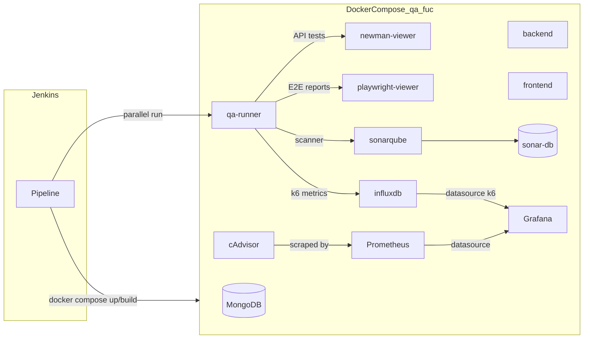

# Informe de Calidad y Seguridad del Software

**Proyecto:** fihacaracterizacion (variante QA FUC)  
**Documento:** informe3al9 — ciclo de vida, automatización y controles  
**Referencias técnicas:** `docker-compose.qa_fuc.yml`, `Jenkinsfile`, `docker-compose.jenkins.yml`  
**Versión del documento:** 1.1 (alineado con especificación institucional + evidencias técnicas)  
**Referencia de especificación:** documento base *Calidad y Seguridad del Software – Ciclo de vida* (historia informe3al9).

---

## Parte A — Alineación con la especificación institucional

### A.1 Propósito del documento (historia de usuario)

Como **equipo de QA y calidad** del proyecto, se elabora y documenta el apartado de **Calidad y Seguridad del Software** correspondiente al **ciclo de vida**, para **evidenciar formalmente** ante la Oficina de Sistemas y los entes de control los lineamientos, controles, actividades, resultados de pruebas y mecanismos de aseguramiento implementados, en aras de la **confiabilidad, integridad, disponibilidad y desempeño** del sistema.

La **Parte A** de este archivo responde a la **estructura y criterios** definidos en la especificación. La **Parte B** (a partir del resumen ejecutivo técnico) consolida la **implementación real** del proyecto *fihacaracterizacion* (Docker Compose FUC, Jenkins, SonarQube, Newman, Playwright, k6, Prometheus, cAdvisor, Grafana). **No debe documentarse como implementado** lo que el equipo no ejecute; donde falte evidencia, se deja **placeholder explícito**.

### A.2 Tabla de cobertura: especificación ↔ contenido de este informe

| Requisito de la especificación | ¿Cumple hoy el texto del repo? | Dónde se aborda / qué falta |
|--------------------------------|--------------------------------|-----------------------------|
| Estándares de desarrollo (convenciones, estilo, **code review**, **estrategia de ramas** solo como manejo de branches) | **Parcial** | Completar **§A.3.1** con evidencia del equipo (guías, `.editorconfig`, plantillas de PR, política de ramas en Git). Este informe no sustituye ese contenido hasta que se anexe. |
| Pruebas funcionales: unitarias, integración, **aceptación** por módulo, cobertura, resultados (aprobadas/fallidas/pendientes), hallazgos y correctivas | **Parcial** | **Parte B** describe **cobertura** (Sonar/Jenkins), **API** (Newman), **E2E** (Playwright). Falta **tabla por módulo** y **registro de hallazgos/correctivas** en **§A.3.2** (plantilla + capturas). |
| Pruebas no funcionales: rendimiento, estrés, carga, **usabilidad**; tiempos de respuesta, usuarios concurrentes, degradación, optimizaciones | **Parcial** | **k6 + Grafana/Influx/Prometheus/cAdvisor** en Parte B cubren **carga/rendimiento/estrés** según scripts ejecutados. **Usabilidad** no está cubierta aquí: **§A.3.3**. Métricas numéricas: completar con reportes reales (no inventar). |
| Validaciones técnicas (campos, tipos, integridad, consistencia entre capas) | **Pendiente** | **§A.3.4** — evidencia desde pruebas manuales/automatizadas o criterios de aceptación por historia. |
| Mecanismos de QA: proceso, herramientas (ej. Kiwi TCMS, Insomnia, k6, axe), criterios de aceptación, flujo de reporte de hallazgos | **Parcial** | Herramientas **reales del repo**: Jenkins, Newman, SonarQube, Playwright, k6, Grafana, etc. Si el equipo usa **Kiwi / Insomnia / axe**, documentarlo en **§A.3.5** o declarar “no aplica / no implementado”. |
| Resultados: hallazgos, acciones correctivas, estado frente a criterios | **Pendiente** | **§A.3.6** — tabla por sprint o por build; enlazar artefactos Jenkins y tickets. |
| Seguridad: autenticación/autorización (JWT, OAuth, etc.) | **Delegado / pendiente en este doc** | Especificación: responsable indicada **Diana Vélez**. Este informe solo puede enlazar o dejar **§A.4.1** vacío hasta su aporte. |
| Protección de datos sensibles, TLS, política de datos personales | **Delegado / pendiente** | **Diana Vélez** — **§A.4.2**. |
| Vulnerabilidades, remediación, pentesting | **Parcial** | SonarQube (SAST) y dependencias en Parte B; **pentesting** no debe afirmarse sin informe: **§A.4.3**. |
| Buenas prácticas OWASP / desarrollo seguro | **Parcial** | Relación con Sonar + prácticas de código en **§A.4.4**; completar con revisión arquitectura. |
| Cumplimiento políticas SENA / institucionales | **Pendiente** | **§A.4.5** — texto de alineación a cargo de Oficina de Sistemas / líder técnico. |
| Reglas de negocio (evidencias verificables, no fingir controles, aprobaciones, hallazgos críticos, actualización por sprint) | **Parcial** | **§A.5** reproduce las reglas; **firma y fechas** en **§8** y tabla **§A.6**. |
| Criterios de aceptación 1–3 (Gherkin) | **Parcial** | **§A.6** — checklist; completar con evidencias reales. |

**Conclusión honesta:** el documento del repositorio **sí** cumple de forma sólida con la **dimensión técnica de automatización QA** acordada al stack *fihacaracterizacion*; **no** sustituye por sí solo todo el alcance del archivo del Escritorio hasta completar las secciones **A.3.x–A.4.x** con evidencias y los apartes asignados a **Diana Vélez** y aprobaciones institucionales.

### A.3 Dimensión 1 — Calidad del software

#### A.3.1 Estándares de desarrollo adoptados

- **Convenciones y guías de estilo:** *[Completar: lenguaje(s), linters, formateadores, enlaces a guías internas.]*  
- **Revisión de código (Code Review):** *[Completar: política de PR/MR, revisores mínimos, plantilla.]*  
- **Estrategia de versionamiento (solo ramas):** *[Completar: nombres de ramas, flujo (trunk-based, Git Flow, etc.), protección de `main`/`develop`, quién mergea.]*  

**[Insertar captura: política de ramas en GitLab/GitHub/Azure DevOps o extracto del README del equipo]**

#### A.3.2 Pruebas funcionales

| Módulo / épica | Tipo (unitaria / integración / aceptación) | Herramienta o capa | Cobertura o alcance | Aprobadas | Fallidas | Pendientes | Hallazgos | Acción correctiva | Evidencia (build, reporte) |
|----------------|---------------------------------------------|-------------------|---------------------|-----------|----------|------------|-----------|-------------------|---------------------------|
| *[Ej.: API auth]* | Integración | Newman | Colección Postman X | | | | | | |
| *[Ej.: flujo registro]* | Aceptación / E2E | Playwright | Specs en `…` | | | | | | |
| *[Ej.: backend]* | Unitarias + cobertura | Go test / Sonar | Ver `coverage-backend.xml` | | | | | | |

**[Insertar captura: Jenkins Cobertura + JUnit + reportes Newman/Playwright según corresponda]**

#### A.3.3 Pruebas no funcionales

- **Rendimiento / carga / estrés:** scripts **k6** (`qa/performance`), telemetría **InfluxDB**, tableros **Grafana** (`k6`, `k6-perf`), infra **Prometheus/cAdvisor** (Parte B).  
- **Tiempos de respuesta y usuarios concurrentes:** *[Completar con valores del último informe k6 (`summary.json`, Grafana); no extrapolar sin ejecución.]*  
- **Degradación y optimización:** *[Documentar hallazgos y tuning (p. ej. `K6_PEAK_VUS`, backend, DB).]*  
- **Usabilidad:** *[Si hay pruebas con usuarios o checklists, anexar; si no aplica, declararlo.]*  

**[Insertar captura: Grafana k6 y, si aplica, extracto numérico de latencias / VUs]**

#### A.3.4 Validaciones técnicas

*[Documentar validaciones de campos, tipos, integridad referencial y consistencia API–UI–BD según casos de prueba o historias.]*  

**[Insertar captura: ejemplos de casos o matriz de validación]**

#### A.3.5 Mecanismos de aseguramiento de QA (proceso y herramientas)

- **Proceso adoptado:** CI con Jenkins, entorno reproducible Docker (Parte B), definición de hecho y criterios de aceptación por historia.  
- **Herramientas en uso en el repo:** Jenkins, Docker Compose, Newman, SonarQube, Playwright, k6, Grafana, Prometheus, cAdvisor, InfluxDB (y opcionales Allure, visores HTML).  
- **Herramientas mencionadas en la especificación y no listadas en el pipeline:** Kiwi TCMS, Insomnia, axe DevTools — *[Marcar “en uso” / “no implementado” / “sustituido por …” con justificación.]*  
- **Flujo de reporte y corrección de hallazgos:** *[Enlace a tablero de issues, SLA, responsables.]*  

#### A.3.6 Resultados de pruebas y estado de cumplimiento

*[Resumen por período (sprint o release): hallazgos totales, cerrados, en curso; cumplimiento frente a criterios de calidad definidos por el equipo.]*  

---

### A.4 Dimensión 2 — Seguridad del software

> **Nota:** En la especificación del Escritorio, **autenticación/autorización** y **protección de datos sensibles** están asignadas a **Diana Vélez**. Los subapartados siguientes deben completarse con su contenido o referencias oficiales.

#### A.4.1 Control de autenticación y autorización

*[JWT, OAuth 2.0, Keycloak, SSO, protección de rutas y endpoints — a cargo Diana Vélez.]*  

#### A.4.2 Protección de datos sensibles

*[Datos sensibles, cifrado en tránsito y en reposo, tratamiento de datos personales — a cargo Diana Vélez.]*  

#### A.4.3 Manejo de vulnerabilidades y pentesting

- **Identificación:** SonarQube (calidad y reglas de seguridad), dependencias; revisiones periódicas.  
- **Pentesting:** *[Solo documentar si existe informe formal; no declarar sin evidencia.]*  

#### A.4.4 Buenas prácticas de desarrollo seguro (OWASP, etc.)

*[Validación de entradas, inyección, XSS, CSRF, etc. — enlazar con diseño de API, frontend y resultados Sonar.]*  

#### A.4.5 Cumplimiento de políticas institucionales (SENA y normativa)

*[Texto y referencias a políticas de seguridad de la información — validación Oficina de Sistemas.]*  

---

### A.5 Reglas de negocio del documento (según especificación)

1. El documento se basa en **evidencias reales y verificables**; no se documentan controles o pruebas no implementadas como ejecutadas.  
2. Cada sección debe contar con **evidencias adjuntas o referenciadas** (reportes, capturas).  
3. **Formato institucional:** si la Oficina de Sistemas define plantilla, migrar el contenido de este Markdown/HTML/DOCX a dicha plantilla.  
4. **Revisión y aprobación** previa a publicación oficial: líder técnico, arquitecto de software y Oficina de Sistemas (ver **§8**).  
5. Hallazgos de seguridad **críticos/altos:** acciones correctivas **implementadas y documentadas** antes del cierre de la historia; medios/bajos pueden quedar con plan de remediación.  
6. El documento debe **actualizarse al cierre de cada sprint** con resultados, hallazgos y correctivas del período.  

---

### A.6 Criterios de aceptación (resumen)

| # | Criterio (especificación) | Evidencia requerida | Estado |
|---|---------------------------|---------------------|--------|
| **1** | Estándares de desarrollo, **branching**, code review, herramientas QA y flujo de hallazgos documentados | Secciones **A.3.1**, **A.3.5** + capturas | Pendiente / parcial |
| **2** | Pruebas funcionales: por módulo, cobertura, resultados (aprob/fall/pend), hallazgos y correctivas | Tabla **A.3.2** + Jenkins/Sonar/Playwright | Pendiente / parcial |
| **3** | Pruebas no funcionales: rendimiento/estrés/carga, tiempos, VUs, degradación, optimización | **A.3.3** + k6/Grafana | Pendiente / parcial |

---

## 1. Resumen ejecutivo (Parte B — implementación técnica en el repo)

Este informe describe cómo el proyecto **fihacaracterizacion** integra la **calidad** y la **seguridad del software** en su ciclo de vida, mediante un stack QA contenedorizado (Docker Compose, perfil FUC con MongoDB) y un pipeline orquestado en **Jenkins**. Las pruebas automatizadas incluyen API (Newman), análisis estático (SonarQube), pruebas end-to-end (Playwright) y, de forma opcional, rendimiento (k6) con telemetría hacia InfluxDB. La **observabilidad del entorno QA** se complementó integrando **cAdvisor** (métricas de contenedores), **Prometheus** (almacenamiento y consulta de series temporales) y **Grafana** con **provisioning embebido en imagen**: datasources para InfluxDB (k6) y Prometheus, más dashboards JSON precargados (**k6** y **cAdvisor**), de modo que en un solo panel se correlacionan carga de pruebas e infraestructura Docker.

Los apartados siguientes detallan arquitectura, flujo de ejecución, herramientas, riesgos de seguridad en entorno QA y **espacios reservados** donde debe insertarse la evidencia en forma de capturas de pantalla.

---

## 2. Contexto del proyecto y entorno QA FUC

En la variante **FUC**, el entorno de calidad se define principalmente en `docker-compose.qa_fuc.yml`:

| Componente | Rol |
|------------|-----|
| **db** | MongoDB 7 — persistencia de la aplicación en QA |
| **backend** | API (Go), expuesta según `BACKEND_PORT` (ej. 8088→8080 interno) |
| **frontend** | Aplicación web (Next.js, target `runner`), puerto publicado según `FRONTEND_PORT` |
| **Red** | `qa-network` con nombre derivado de `PROJECT_NAME` |

El archivo de variables típico es **`.env.qa_fuc`** (no debe incluirse en el repositorio con secretos reales). Jenkins, cuando el nombre del job indica FUC, selecciona ese compose y ese env frente a la variante RAV (`.env.qa` / `docker-compose.qa.yml`).

**[Insertar captura: diagrama o lista de servicios en Docker Desktop / `docker compose ps` para el proyecto `qa-pipeline` en FUC]**

---

## 3. Calidad en el ciclo de vida del software

### 3.1 Fases y encaje de la automatización

| Fase del ciclo | Actividad de calidad en este proyecto |
|----------------|----------------------------------------|
| Desarrollo | Código y pruebas unitarias/integración en repos de backend y frontend |
| Integración continua (CI) | Pipeline Jenkins que levanta dependencias Docker, ejecuta Newman, Sonar, Playwright y opcionalmente k6 en paralelo |
| Verificación | Reportes HTML archivados, cobertura publicada, SonarQube como umbral de calidad de código |
| Entrega / feedback | Notificaciones (p. ej. Discord si `DISCORD_WEBHOOK_URL` está definida), artefactos por build |

### 3.2 Orquestación: Jenkinsfile

El pipeline declarativo en `Jenkinsfile` define:

- **Parámetros booleanos:** `RUN_NEWMAN`, `RUN_SONAR`, `RUN_PLAYWRIGHT`, `RUN_K6` (k6 por defecto desactivado).
- **Entorno:** `ENVIRONMENT=qa`, `COMPOSE_PROJECT_NAME=qa-pipeline`, `COMPOSE_PROFILES=test-e2e,sonar`.
- **Comando Compose unificado:** `docker compose -p qa-pipeline --env-file … -f docker-compose.qa_fuc.yml -f docker-compose.jenkins.yml` (cuando aplica FUC).
- **Directorio de reportes en contenedor:** para FUC, `QA_REPORTS_DIR=/qa/reports/fuc`; en el agente Jenkins, `qa_reports_ws`.

Etapas principales:

1. **Preparar Entorno y Dependencias Docker** — Limpieza selectiva de contenedores, `up` de Sonar (DB + servidor), InfluxDB, cAdvisor, Prometheus, Grafana, visores Newman/Playwright, aplicación (db, backend, frontend), espera de healthchecks, build de `qa-runner`.
2. **Tests en Paralelo** — Ramas paralelas que ejecutan `qa-runner` con flags mutuamente excluyentes por contenedor (`RUN_NEWMAN` / `RUN_SONAR` / `RUN_PLAYWRIGHT` / `RUN_K6`) y copian resultados al workspace.
3. **post always** — Archivo de artefactos, publicación de cobertura (Cobertura), JUnit para JS, reportes HTML (Playwright, Newman), Performance Report para k6, registro de issues Go vet, etc.

**[Insertar captura: vista del job Jenkins mostrando los stages “Preparar Entorno…”, “Tests en Paralelo” y el resultado del build]**

**[Insertar captura: parámetros del build (RUN_NEWMAN, RUN_SONAR, RUN_PLAYWRIGHT, RUN_K6) en la UI de Jenkins]**

---

## 4. Stack Docker y herramientas de calidad

### 4.1 Servicios definidos en `docker-compose.qa_fuc.yml`

- **Calidad y análisis:** `sonar-db` (Postgres 15), `sonarqube` (imagen community 10.4), puerto **9000**.
- **Orquestador de pruebas:** `qa-runner` (build desde `qa/Dockerfile.qa`), script `run-tests_fuc.sh`, perfiles `test-e2e` / `all`; variables `SONAR_HOST_URL`, `SONAR_TOKEN`, `PROJECT_KEY`, flags `RUN_*`.
- **Rendimiento y observabilidad:** `influxdb` (1.8, DB k6); **cAdvisor** (`gcr.io/cadvisor/cadvisor:v0.49.1`) expone métricas de uso de CPU, memoria y red de contenedores; **Prometheus** (imagen construida con `qa/Dockerfile.prometheus`, config embebida) hace *scraping* de cAdvisor; **Grafana** (`qa/Dockerfile.grafana`) incluye *provisioning* de **dos datasources** (`qa/grafana/provisioning/datasources/influxdb.yml`, `prometheus.yml`) y **dashboards JSON** en la imagen (`qa/grafana/dashboards/k6.json`, `cadvisor.json`), de forma que el tablero de Grafana queda **complementado** respecto al solo-k6: se visualizan tanto resultados de carga como salud de contenedores. Puertos típicos en host: Grafana `GRAFANA_HOST_PORT` (p. ej. **3010**), Prometheus **9090**, cAdvisor `CADVISOR_HOST_PORT` (p. ej. **8089**), InfluxDB **8086**.
- **Visores de reportes (Nginx):** `newman-viewer` puerto **8181**, `playwright-viewer` puerto **8182** (en Jenkins los reportes se sincronizan con `docker cp` por limitaciones DinD).
- **Opcional:** `allure` / `allure-ui` / `allure-nginx` (perfil viewers), `jenkins` (perfil jenkins) con montaje del repo en `/app` y socket Docker.

### 4.2 Newman (pruebas de API)

- Se ejecuta en contenedor `qa-runner-newman` vía `compose run --name qa-runner-newman` con `RUN_NEWMAN=true`.
- Reportes copiados a `qa_reports_ws/newman/`; publicación HTML si existe `index.html`.
- Visor local típico: **http://localhost:8181** (según `PROJECT_NAME` el nombre del contenedor varía).

**[Insertar captura: reporte HTML de Newman en el visor 8181 o en Jenkins “Newman API Report”]**

**[Insertar captura: fragmento de `newman-report.json` o resumen de aserciones en consola Jenkins]**

### 4.3 SonarQube (calidad y seguridad de código)

- Servidor en **http://localhost:9000** (post-build del pipeline lo recuerda en consola).
- El análisis se lanza desde `qa-runner` con `RUN_SONAR=true`; se copian al workspace, entre otros: `coverage-backend.out`, `coverage-backend.xml`, `js-test-report.xml`, `coverage-frontend.lcov`, `govet.txt`.

**[Insertar captura: dashboard del proyecto en SonarQube — bugs, vulnerabilidades, code smells, cobertura]**

**[Insertar captura: Security Hotspots o vulnerabilidades detectadas (si el proyecto las reporta)]**

### 4.4 Playwright (pruebas E2E)

- Contenedor `qa-runner-e2e` con `RUN_PLAYWRIGHT=true`.
- Reportes en `qa_reports_ws/playwright-html/` y `playwright-results/`.
- Visor: **http://localhost:8182**; en Jenkins: “Playwright E2E Report”.

**[Insertar captura: informe HTML de Playwright (resumen de pruebas pasadas/fallidas)]**

**[Insertar captura: traza o screenshot de un caso fallido, si aplica al informe académico]**

### 4.5 k6, InfluxDB, Prometheus, cAdvisor y Grafana (rendimiento e infraestructura)

- **k6:** activado con `RUN_K6=true` en Jenkins (por defecto false en parámetros). Las métricas de la prueba se envían a InfluxDB (`--out influxdb=http://influxdb:8086/k6`).
- **Grafana (dashboard complementado):** la imagen construida con `qa/Dockerfile.grafana` copia *datasources* y *dashboards* al arranque (sin depender de *bind mounts* en DinD). Además del tablero orientado a **k6** (`k6.json`), existe un dashboard dedicado a **métricas de contenedores vía cAdvisor** (`cadvisor.json`), alimentado por el datasource **Prometheus** (`http://prometheus:9090`). El pipeline de Jenkins configura además el *home dashboard* `k6-perf` cuando Grafana está listo.
- **Prometheus:** recopila métricas expuestas por cAdvisor según la configuración embebida en la imagen Prometheus del proyecto.
- **cAdvisor:** ejecuta con perfil privilegiado y volúmenes de host en solo lectura para exponer métricas Docker al scrape de Prometheus.

**[Insertar captura: Grafana — dashboard k6 / “k6-perf” tras una ejecución de carga]**

**[Insertar captura: Grafana — dashboard cAdvisor (métricas de contenedores) con datasource Prometheus]**

**[Insertar captura: Prometheus — Status → Targets, objetivo cAdvisor en estado UP]**

**[Insertar captura: interfaz web de cAdvisor (puerto host configurado, p. ej. 8089)]**

**[Insertar captura: resumen k6 (`summary.json`) o Performance Report en Jenkins, si se ejecutó k6]**

### 4.6 Otras publicaciones en Jenkins

- Cobertura backend (adapter Cobertura), JUnit desde `js-test-report.xml`, Go vet como issues, Allure si hay resultados en `allure-results`.

**[Insertar captura: gráfico de cobertura publicado en Jenkins]**

**[Insertar captura: Allure report, si el equipo usa el perfil viewers]**

---

## 5. Seguridad del software (enfoque pipeline y entorno QA)

### 5.1 Controles técnicos

| Control | Implementación / notas |
|---------|-------------------------|
| Análisis estático + reglas de seguridad | SonarQube sobre backend y frontend; revisión de hotspots y dependencias según configuración del servidor |
| Secretos | `SONAR_TOKEN`, credenciales K6 (`K6_AUTH_*`), credenciales Mongo en `.env.qa_fuc` — deben proveerse por Jenkins credentials o env seguro, no en Git |
| Superficie de ataque QA | Múltiples puertos expuestos al host (DB, API, frontend, 9000, 8086, 8181, 8182, Grafana, Prometheus, cAdvisor, etc.) — **solo para redes de confianza** |
| Aislamiento | Red Docker dedicada; contenedores con healthchecks para reducir estados inconsistentes |
| Imágenes | Versiones fijadas en compose (p. ej. `mongo:7`, `postgres:15-alpine`, `sonarqube:10.4-community`) — conviene política de actualización y escaneo de imágenes |

### 5.2 Limitaciones y buenas prácticas

- El entorno **no equivale a producción**: credenciales por defecto en Grafana (`admin`/`admin` en compose) son aceptables solo en QA aislado; deben cambiarse o no exponerse públicamente.
- SonarQube Community tiene alcance limitado frente a ediciones comerciales; conviene complementar con SCA (dependencias) y políticas de branch en el servidor SCM.
- Documentar y rotar tokens (`SONAR_TOKEN`) periódicamente.

**[Insertar captura: configuración de credenciales en Jenkins (sin mostrar valores sensibles) o máscara de variables]**

---

## 6. Matriz resumen herramienta → propósito → evidencia

| Herramienta | Propósito | Dónde insertar evidencia |
|-------------|-----------|---------------------------|
| Docker Compose FUC | Entorno reproducible app + QA | Captura `docker compose ps` / diagrama |
| Jenkins | Orquestación CI | Captura pipeline y parámetros |
| Newman | Contrato y regresión API | Captura visor 8181 o artefacto HTML |
| SonarQube | Calidad y seguridad de código | Captura proyecto / measures |
| Playwright | E2E usuario | Captura reporte HTML |
| k6 + Influx + Grafana | Rendimiento de prueba | Captura dashboard k6 en Grafana / summary |
| Prometheus + cAdvisor | Métricas de contenedores → TSDB | Captura Targets en Prometheus y/o UI cAdvisor |
| Grafana (provisioning) | Vista unificada k6 + infra | Captura ambos dashboards (k6 y cAdvisor) y datasources |

---

## 7. Conclusiones y próximos pasos sugeridos

- **Parte A:** Completar tablas y apartados **A.3.x–A.4.x**, integrar el material de **Diana Vélez** donde corresponda, y cerrar los **criterios de aceptación §A.6** con evidencias verificables, conforme a las **reglas de negocio §A.5**.
- **Parte B:** El proyecto dispone de una **cadena de calidad integrada** al ciclo de vida: mismo compose FUC que en documentación, ejecutado de forma consistente desde Jenkins con perfiles `test-e2e` y `sonar`, y una **línea de observabilidad** que combina **cAdvisor**, **Prometheus** y **Grafana** con dashboards **complementados** (k6 + contenedores).
- La **seguridad en pipeline/QA** (Parte B, §5) se apoya en análisis estático, gestión de secretos y reducción de exposición del entorno; la **seguridad de aplicación e institucional** debe cerrarse en **§A.4** y aprobaciones **§8**.
- Insertar las **capturas** en cada bloque `[Insertar captura: …]` y actualizar el documento **al cierre de cada sprint** (especificación institucional).

---

## 8. Control de documento

| Campo | Valor |
|-------|--------|
| Elaborado para | Proyecto fihacaracterizacion |
| Archivo fuente | informe3al9.md |
| Exportación Word | informe.docx (desde HTML/Markdown con Word o pandoc) e informe.html como alternativa legible en navegador |
| Fecha de elaboración | *(completar)* |
| Responsable QA | *(completar)* |
| Revisión — Líder técnico | Nombre, firma, fecha *(según especificación)* |
| Revisión — Arquitecto de software | Nombre, firma, fecha *(según especificación)* |
| Aprobación — Oficina de Sistemas | Nombre, firma, fecha *(según especificación)* |
